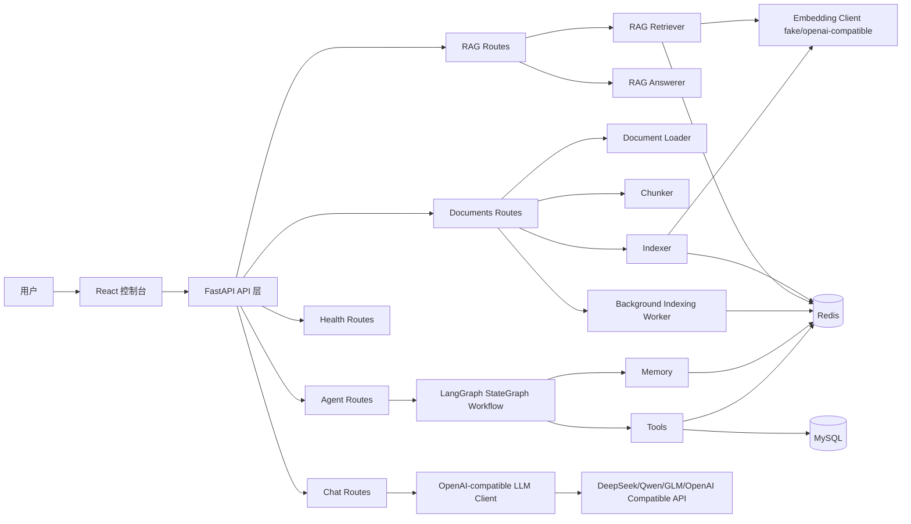
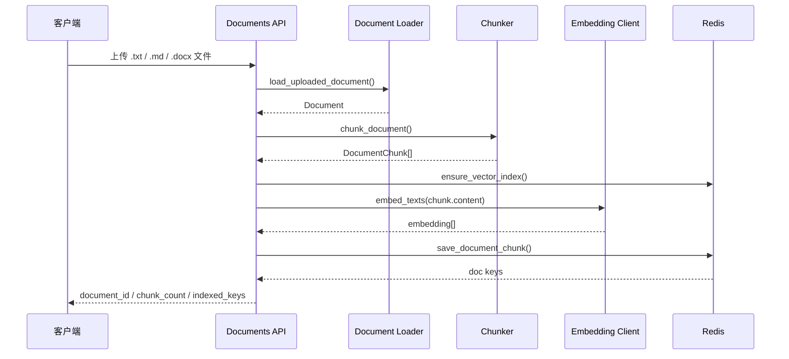
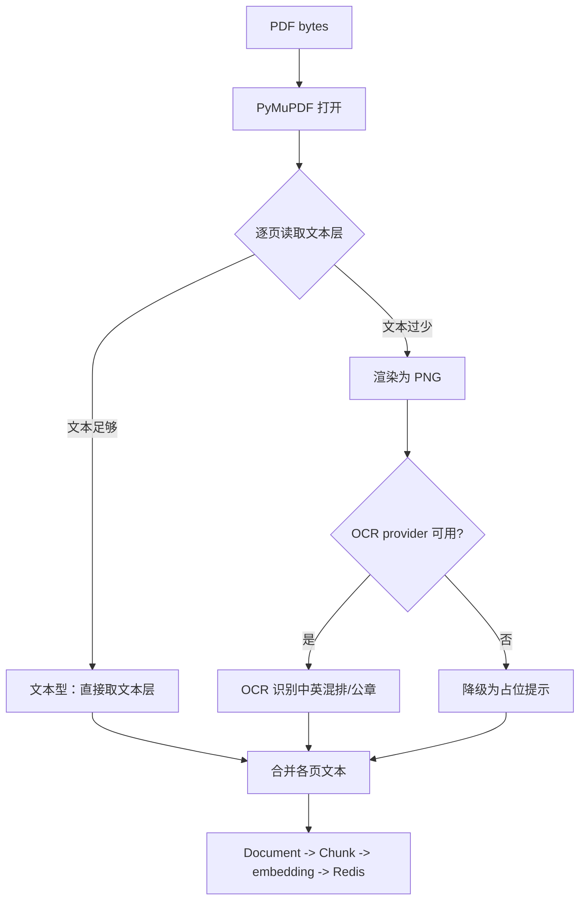
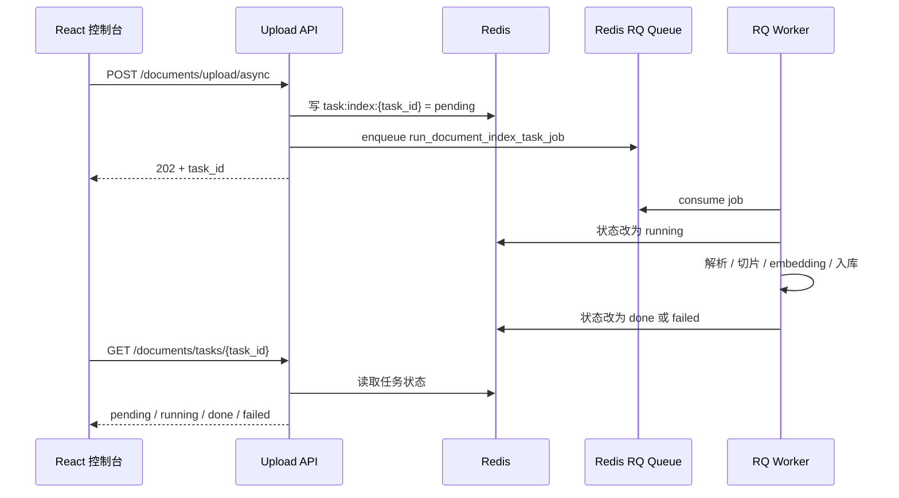
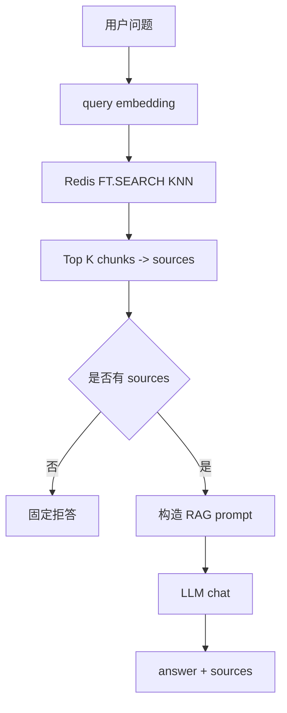
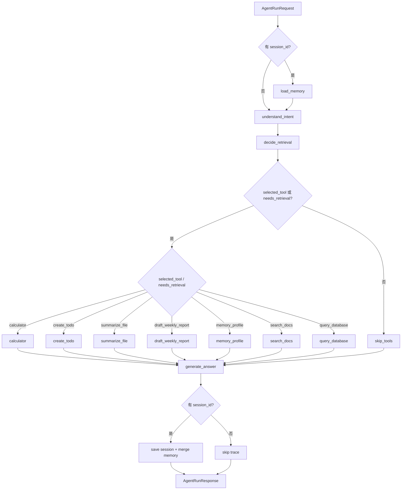
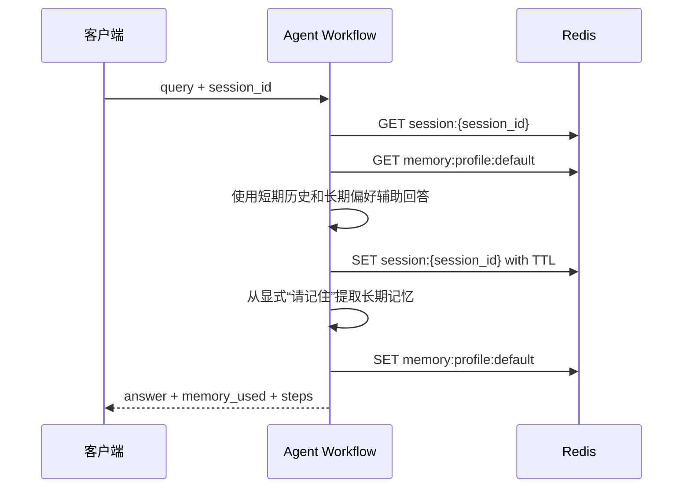
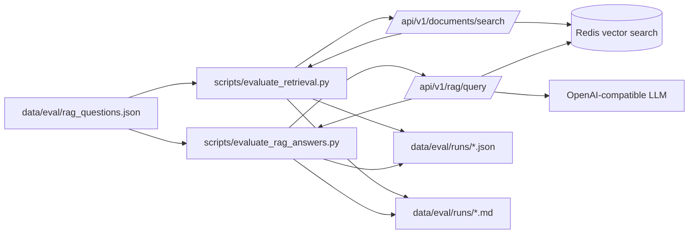

# 架构说明：AI Resume Job Agent / AI 简历求职助手

本文档用于说明当前项目的真实工程结构、核心流程和面试讲法。它不是理想化架构图，而是对当前代码实现的整理。

## 系统概览

AI Resume Job Agent 是一个面向求职知识库和办公自动化的 Agent/RAG 项目。当前后端使用 FastAPI，Redis 承担会话、长期记忆、任务状态和文档向量检索，MySQL 保存简历投递结构化记录，前端使用 React + Vite + TypeScript 做演示控制台。

当前项目有三个重要边界需要诚实说明：

- embedding 第一版使用确定性假 embedding，用于跑通工程链路，不代表真实语义效果。
- LLM client 已支持 OpenAI-compatible tool-calling adapter，可以发送 `tools/tool_choice`、解析模型返回的 `tool_calls`，也可以在二次请求中携带 assistant `tool_calls` 和 `tool` message。
- Agent workflow 已使用 LangGraph `StateGraph` 编排，并在 `decide_retrieval` 后使用条件边路由到工具执行或跳过工具；普通聊天分支可通过 LangGraph `ToolNode` 子图执行最多 3 轮 bounded LLM tool calls；当前默认接入 `local_file` checkpoint，可跨本地进程重启重新加载 checkpoint，但不是生产级多 worker 恢复，也不是无限循环式 ReAct。
- MySQL 数据库问答第一版使用确定性 SQL 模板和只读安全校验，不是 LLM 自由生成 SQL。



## 模块边界

| 模块 | 主要文件 | 职责 |
|------|----------|------|
| API 层 | `app/api/routes/*.py` | 接收 HTTP 请求、做依赖注入、把异常转换成 HTTP 响应 |
| 配置与日志 | `app/core/config.py`, `app/core/logging.py` | 环境变量配置、CORS、结构化请求日志 |
| 模型层 | `app/models/*.py` | Pydantic 请求/响应模型和内部数据结构 |
| 服务层 | `app/services/*.py` | Redis、MySQL、LLM、Embedding 等外部服务访问封装 |
| RAG 层 | `app/rag/*.py` | 文档解析、切片、入库、检索、RAG prompt 构造 |
| Agent 层 | `app/agent/*.py` | Agent state、意图识别、工具调用、回答生成、记忆保存 |
| 工具层 | `app/tools/*.py` | search_docs、query_database、calculator、create_todo、summarize_file、draft_weekly_report、tool schema registry |
| 记忆层 | `app/memory/*.py` | 短期 session 记忆和长期 profile 记忆 |
| 异步任务 | `app/workers/document_indexing.py` | 文档后台索引任务状态流转 |
| 评测 | `app/evaluation/retrieval.py`, `scripts/evaluate_retrieval.py` | 固定问题集检索评测和报告输出 |
| 前端 | `frontend/src/*` | 本地演示控制台、上传、轮询、检索、Agent 调用 |

面试讲法：

> 我把项目按 API、Service、RAG、Agent、Tools、Memory、Worker 和 Evaluation 做模块拆分。API 层只负责 HTTP 输入输出，Redis、LLM、Embedding 等外部依赖都封装在服务层，RAG 和 Agent 复用这些服务，避免把业务逻辑堆在路由函数里。

## Redis 数据设计

| Key 形态 | 用途 | TTL |
|----------|------|-----|
| `session:{session_id}` | 短期会话历史 | 有，默认 24 小时 |
| `memory:profile:{profile_id}` | 长期用户偏好、项目背景、常用约束 | 第一版不设短 TTL |
| `doc:{document_id}:{chunk_index}` | 文档 chunk、metadata、FLOAT32 embedding | 不设短 TTL |
| `task:index:{task_id}` | 异步索引任务状态 | 有，默认 24 小时 |

面试讲法：

> Redis 在项目里不是只当缓存用，而是承担了短期会话、长期记忆、异步任务状态和向量检索。不同数据通过 key 前缀做 namespace 隔离，并对短生命周期数据设置 TTL，避免会话和任务状态无限堆积。

## MySQL 数据设计

MySQL 第一版围绕求职投递记录建模，服务结构化数据库问答。

| 表 | 用途 |
|----|------|
| `job_applications` | 公司、岗位、渠道、投递时间、状态、城市、薪资范围、备注 |
| `application_events` | 面试、HR 联系、offer、拒信、跟进等事件 |

应用通过 `agent_reader` 只读账号访问 MySQL。`query_database` 工具会先把常见投递问题映射到确定性 SQL 模板，再经过安全层执行：

- 只允许 `SELECT`。
- 禁止 DDL/DML、多语句和 SQL 注释。
- 强制 `LIMIT`，并限制最大返回行数。
- 只允许访问 `job_applications` 和 `application_events`。

面试讲法：

> MySQL 负责强结构、强准确的数据，例如“投了哪家公司什么岗位”“目前哪些进入面试”“哪个渠道效果最好”。它和 RAG 不同：RAG 处理非结构化文档，MySQL 处理结构化投递记录。数据库工具用只读账号和 SQL 安全校验，避免让模型裸连数据库。

## 文档入库流程

当前同步入库接口是 `POST /api/v1/documents/upload`，异步入库接口是 `POST /api/v1/documents/upload/async`。文档 loader 支持 `.txt`、`.md`、`.docx` 和 `.pdf`；DOCX 会提取段落和表格单元格文本，PDF 走文本层/OCR hybrid 路由（见下节），都统一转换成 `Document`。



面试讲法：

> 文档入库被拆成解析、切片、embedding 和 Redis 写入四步。每个 chunk 都保存正文、metadata 和向量字段，metadata 里保留来源文件、chunk 序号和字符范围，后续检索结果可以展示引用来源并方便排查。

## PDF 解析与 OCR

PDF 走 hybrid（文本层 / OCR）路由，避免对电子版 PDF 做无谓 OCR，也避免 OCR 噪声污染 embedding：



- 文本层字符数达到阈值（`PDF_TEXT_LAYER_MIN_CHARS`）的页判定为电子版，直接取文本（快、准、免费；公章是覆盖图层、中英混排都不影响文本层提取）。
- 文本层过少的页判定为扫描件/图片，按 `PDF_OCR_DPI` 渲染成 PNG 后交给 OCR provider 识别。
- OCR 不可用（未启用/未安装/失败）时，该页降级为明确占位提示，不影响整篇上传。
- `PDF_OCR_MAX_PAGES` 限制单个 PDF 的处理页数，控制成本和延迟。

OCR provider 可插拔（`PDF_OCR_PROVIDER`）：

| provider | 说明 | 适用场景 |
|----------|------|----------|
| `paddleocr` | 本地、离线、国产友好（PP-OCRv5/v6），支持中英混排，公章文字 best-effort | 政府/政策文件、离线/国产化要求 |
| `api` | OpenAI-compatible 视觉 LLM，对公章、中英混排、复杂版面理解更强 | 有联网和 Key、追求复杂版面质量 |
| `none` | 关闭 OCR，扫描页降级为占位 | 只处理电子版 PDF |

> 工程注记：paddlepaddle 3.x 在部分 CPU 上 PIR + oneDNN 有兼容问题（`ConvertPirAttribute2RuntimeAttribute not support`），项目在初始化 PaddleOCR 时用 `enable_mkldnn=False` 规避。

面试讲法：

> PDF 我没有无脑全上 OCR，而是做了文本层检测的 hybrid 路由：电子版直接读文本层，扫描件才渲染成图走 OCR。这样省成本、避免 OCR 噪声污染向量，也让上传在 OCR 不可用时优雅降级。OCR 引擎做成可插拔，本地用 PaddleOCR（离线、支持中英混排和公章），也能切到视觉 LLM API，对公章和复杂版面理解更强。

## 异步索引流程

当前异步索引已使用 RQ worker。API 只创建任务状态并把 job 入 Redis 队列，worker 独立消费队列并执行解析、切片、embedding 和 Redis chunk 写入。任务状态仍保存在项目自己的 Redis key 中，前端继续通过 `task_id` 轮询。



面试讲法：

> 异步索引接口先创建 task_id 并入队，API 不再直接执行耗时索引。RQ worker 从 Redis 队列消费任务，完成文档解析、切片、embedding 和 Redis 写入，再把状态更新为 done 或 failed。前端仍然只轮询 task 状态，所以从 BackgroundTasks 迁移到 RQ 时外部接口没有大改。

## RAG 查询流程

当前检索接口是 `POST /api/v1/documents/search`，RAG 回答接口是 `POST /api/v1/rag/query`。没有配置真实 `LLM_API_KEY` 时，RAG 生成回答会返回 503；无检索结果时会直接拒答，不调用 LLM。



面试讲法：

> RAG 查询先把用户问题向量化，再用 Redis KNN 搜索召回 top_k chunks。召回结果会转换成带编号的 sources，RAG prompt 要求模型只能基于这些上下文回答，并使用 `[1]`、`[2]` 引用来源。无上下文时直接拒答，避免浪费 token 和胡编。

## Agent 工作流

当前 Agent 入口是 `POST /api/v1/agent/run`。它使用 LangGraph `StateGraph` 把一次运行编排成 `load_memory -> understand_intent -> decide_retrieval`，随后通过条件边路由到 `call_tools` 或 `skip_tools`，再进入 `generate_answer -> save_trace`，并在响应里返回 steps 方便调试。



面试讲法：

> Agent 不是简单把用户输入直接丢给模型，而是先把请求放进 AgentState，经过意图识别、是否检索判断、工具调用、回答生成和记忆保存几个节点。确定性工具如 calculator、todo、weekly report 不调用 LLM；知识库问题会走 search_docs 工具和 RAG 回答链路。响应里的 steps 可以展示每个节点做了什么。

当前接入的是 LangGraph `StateGraph` 的基础图编排：节点、普通边、条件边、`START`、`END`、`compile()` 和 `ainvoke()`。规则工具调用仍然由项目自己的 `call_tools` 节点完成；普通聊天分支会把安全工具 schema 发给 LLM，如果模型返回 `tool_calls`，会通过一个 LangGraph `ToolNode` 子图执行工具，把结果转换成 OpenAI-compatible `tool` message 后继续交给 LLM。这个循环最多执行 3 轮：模型返回最终文本就停止；连续请求工具达到上限后，会再做一次不带 tools 的最终回答，防止无限工具循环和成本失控。

## LangGraph Checkpoint

当前默认接入的是本项目封装的 `LocalFileCheckpointSaver`。它继承 LangGraph `InMemorySaver` 的行为，并把 `storage`、`writes`、`blobs` 序列化保存到本地文件。这样每次 `graph.ainvoke()` 都带上明确的 `thread_id`，执行后可以读取 LangGraph state snapshot，把 checkpoint metadata 返回给前端或调试工具，同时也能在本地进程重启后重新加载已经落盘的 checkpoint。

默认配置：

- `AGENT_CHECKPOINT_BACKEND=local_file`
- `AGENT_CHECKPOINT_PATH=data/checkpoints/agent_checkpoints.pkl`
- 调试时仍可通过 `AGENT_CHECKPOINT_BACKEND=in_memory` 切回进程内 saver。

线程 ID 规则：

- 有 `session_id` 时：`thread_id = agent-session:{session_id}`。
- 没有 `session_id` 时：`thread_id = agent-request:{uuid}`，保证无会话请求不会共用同一个图线程。

Agent 响应中的 `checkpoint` 字段包含：

- `thread_id`
- `checkpoint_id`
- `checkpoint_namespace`
- `step`
- `created_at`
- `backend=local_file`
- `durable=true`
- `production_ready=false`

现在还提供 checkpoint snapshot 查询接口：

```text
GET /api/v1/agent/checkpoints/{thread_id}
GET /api/v1/agent/checkpoints/{thread_id}/history?limit=20
```

第一个接口返回 latest checkpoint 的元数据，第二个接口返回同一个 thread 下最近若干条 checkpoint 元数据：

- `thread_id`
- `checkpoint_id`
- `parent_checkpoint_id`
- `step`
- `created_at`
- `state_channel_keys`
- `pending_write_count`
- `resume_supported=false`
- `human_in_the_loop_supported=false`

它只暴露 state channel keys，不直接返回完整 `channel_values`。原因是 checkpoint 可能包含用户输入、工具结果和内部状态，直接暴露完整内容会增加隐私和调试信息泄露风险。

需要注意，这个 checkpoint 和 Redis session/memory 不是同一个东西：

- Redis session 保存的是短期对话历史。
- Redis memory profile 保存的是长期偏好和项目背景。
- LangGraph checkpoint 保存的是图执行过程中的状态快照。

当前普通 Agent 的 `local_file` backend 只是单机本地 demo 级持久化：它比纯 `InMemorySaver` 多解决了“本地进程重启后 checkpoint 仍可重新加载”的问题，也能通过 latest/history 查询接口观察 checkpoint metadata，但没有解决多进程并发写入、多副本共享、官方 Redis/Postgres durable backend、通用人工中断恢复和普通 `/agent/run` 的真正继续执行 resume API。因此响应里明确返回 `production_ready=false`。Redis session/memory 仍然是项目自己的对话历史和长期记忆系统，不等于 LangGraph checkpoint。更完整的设计说明见 `docs/checkpoint_resume.md`。

后续生产级 resume API 的设计边界：

```text
GET /agent/checkpoints/{thread_id}
-> 查 latest checkpoint metadata

POST /agent/resume
-> 输入 thread_id、checkpoint_id、用户补充信息或审批结果
-> 使用共享 Redis/Postgres checkpointer 恢复图状态
-> 从中断点继续执行或进入人工审批后的下一节点
```

当前普通 Agent 没有真正执行 `POST /agent/resume`，原因是现有普通 Agent 图还没有可中断节点、人工审批节点和共享生产级 checkpointer。现在先把 checkpoint 可观察性补上，并把 `resume_supported=false` 明确写进响应。求职投递 workflow 另有特定 HITL 路径：`/agent/job-application/review` 在 JD 匹配后中断，`/agent/job-application/resume` 在人工审核后继续生成材料；它不等于普通 Agent 的通用生产级 resume API。

## 记忆流程

短期记忆和长期记忆通过 `session_id` 显式启用。不传 `session_id` 时，Agent 请求保持无状态，避免工具调用无故依赖 Redis 记忆。



面试讲法：

> 短期记忆保存最近会话消息，设置 TTL 防止堆积；长期记忆保存用户偏好、项目背景和常用约束。长期记忆第一版只处理显式“请记住”这类确定性表达，避免让模型随意决定什么该记，降低误记和隐私风险。

## 评测流程

当前评测分两条线：

- `scripts/evaluate_retrieval.py`：评估检索阶段，检查 top_k sources 是否命中预期关键词。
- `scripts/evaluate_rag_answers.py`：评估回答阶段，调用 `/rag/query` 记录 answer、sources、引用编号、关键词命中、拒答、失败分类和改进建议。

真实 embedding retrieval eval 已完成，最新固定 20 题 `hit_rate=1.0`。Answer eval 脚本已支持失败分类、重试退避、分批 offset/limit 和请求间冷却，适合本地 LLM 反代不稳定时分批运行；完整 20 题真实 answer 稳定报告仍需继续跑完后再作为最终质量结论。



面试讲法：

> 我把 RAG 评测拆成 retrieval eval 和 answer eval。Retrieval eval 看 top_k sources 是否命中预期知识；answer eval 再看 LLM 回答是否包含预期关键词、引用编号是否匹配 sources、是否错误拒答，以及失败是检索问题、生成问题、引用问题还是上游模型/网络不稳定。这样能定位到底是召回差、prompt 差、模型差，还是本地反代不稳定。

## 检索精排、Multi-Agent 与断点重连（阶段 27-29）

### 两阶段检索 rerank

向量检索按相似度召回精度有限。检索现支持两阶段：向量召回 `candidate_count`（默认 20）个候选 → cross-encoder reranker（bge-reranker-v2-m3）按 query 相关性重排 → 取 top_k。reranker 可插拔（`RERANK_PROVIDER`：openai-compatible / identity 降级），`documents/search` 和 `rag/query` 全链路接入。混查场景简历问题 hit_rate 从 0.67 提升到 0.80。

### 知识库隔离（collection）

向量索引加 `collection` TAG 字段，上传按 collection 写入，检索用 `(@collection:{x})=>[KNN ...]` 标量预过滤。简历库（`resume`）与项目库（`project_docs`）隔离后，简历问题不被项目文档挤出 top_k（隔离 hit_rate 1.0 vs 混查 0.67）。rerank 与隔离互补：隔离防“查错库”，rerank 优“同库内排序”。

### Multi-Agent supervisor（求职投递）

`POST /api/v1/agent/job-application` 用 LangGraph 循环图：supervisor 路由 → `resume_analyst`（检索简历库提炼）→ `jd_matcher`（对比 JD）→ `material_writer`（生成投递材料）→ 回 supervisor 直到 END。supervisor 按“已完成步骤”路由（而非输出非空），避免推理模型空 content 导致 worker 重复执行。

### HITL 断点重连

`POST /api/v1/agent/job-application/review` 启动带人工审核的投递流程：图在 JD 匹配后的 `human_review` 节点用 LangGraph `interrupt()` 暂停并保存 checkpoint，返回匹配分析供人工审核。`/resume` 用 `Command(resume=decision)` 从中断点继续，把人工补充注入材料生成。这是真正从中断点继续执行（区别于只读的 checkpoint snapshot 查询）。checkpointer 当前是单进程 `InMemorySaver` 单例，生产需共享 Redis/Postgres。

面试讲法：

> 检索我做了两阶段：向量召回 + bge-reranker 精排，并用 collection 做知识库隔离。Agent 不只是单 agent，还实现了 supervisor 多 agent 求职投递协作，以及 LangGraph interrupt/resume 的人工介入断点续跑——投递材料生成前先让人工审核匹配分析，确认后从 checkpoint 恢复，符合“人工确认后再投递”的安全要求。

## MCP client（阶段 34）

MCP（Model Context Protocol）让 Agent 调用外部 MCP server 暴露的工具。

- transport：stdio（本地子进程）/ streamable HTTP（远程）。
- 协议流程：`initialize` → `list_tools` / `list_resources` / `list_prompts`（发现）→ `call_tool` / `read_resource`（执行/读取）；`MCPClient.inspect()` 一次连接同时拿三类能力（连接复用）。
- 能力发现：`GET /api/v1/mcp/capabilities` 汇总每个 server 的 tools / resources / prompts，前端 MCP 面板可视化展示；已验证可接官方第三方 `server-everything`。
- 接入点：`app/services/mcp_client.py` 的 `MCPClient`；Agent 普通聊天分支把 MCP 工具命名为 `mcp_<server>_<tool>`、转成 OpenAI function schema 合并进 bounded tool-call loop；模型 `tool_call` 命中 MCP 工具时经 `call_tool` 执行并回传 tool message。
- 配置：`data/mcp/servers.json`（Claude Desktop / Cursor 同款 `mcpServers` 形态），默认 `MCP_ENABLED=false`。
- 降级：未启用 / 无配置 / 单 server 失败 → 该 server 无工具，Agent 行为不变；MCP 工具异常归类 `mcp_tool_error`，不致整体 500。
- 边界：第一版每次操作独立建连（非连接池）；只连接可信本地 server；MCP 工具只在普通聊天分支暴露。

```text
LLM 普通聊天分支
-> MCPClient.list_tools()（连接各 MCP server 发现工具）
-> 合并工具 schema 发给 LLM
-> 模型返回 tool_call（可能命中 mcp_<server>_<tool>）
-> 本地工具走 ToolNode 子图 / MCP 工具走 MCPClient.call_tool()
-> tool message 回传 -> 模型生成最终回答
```

## API 地图

| 接口 | 用途 |
|------|------|
| `GET /api/v1/health` | 后端健康检查 |
| `GET /api/v1/health/redis` | Redis 连通性检查 |
| `GET /api/v1/health/mysql` | MySQL 连通性检查 |
| `POST /api/v1/chat` | 普通非流式模型对话 |
| `POST /api/v1/chat/stream` | SSE 流式模型对话 |
| `POST /api/v1/documents/upload` | 同步文档入库 |
| `POST /api/v1/documents/upload/async` | 异步文档索引 |
| `GET /api/v1/documents/tasks/{task_id}` | 查询索引任务状态 |
| `POST /api/v1/documents/search` | Redis 向量检索 |
| `POST /api/v1/rag/query` | RAG 问答 |
| `POST /api/v1/agent/run` | Agent 工作流入口 |
| `GET /api/v1/agent/checkpoints/{thread_id}` | 查询 Agent latest checkpoint snapshot metadata |
| `GET /api/v1/agent/checkpoints/{thread_id}/history` | 查询 Agent checkpoint history metadata |
| `POST /api/v1/agent/job-application` | Multi-Agent supervisor 求职投递工作流 |
| `POST /api/v1/agent/job-application/review` | 启动 HITL 投递审核（JD 匹配后中断） |
| `GET /api/v1/mcp/tools` | 已连接 MCP server 的可用工具列表 |
| `GET /api/v1/mcp/servers` | MCP server 连接状态 |
| `GET /api/v1/mcp/capabilities` | MCP server 的 tools / resources / prompts 汇总 |
| `POST /api/v1/agent/job-application/resume` | 从中断点恢复生成投递材料 |

## 当前限制与升级方向

| 当前限制 | 后续升级 |
|----------|----------|
| fake embedding 只能验证链路 | 已适配真实 embedding API；切换前用 `scripts/prepare_embedding_switch.py` 清理旧 Redis 向量数据，配置 Key 后需确认 Redis vector dimension、重建索引并重新评测 |
| 已接入 LangGraph StateGraph、基础条件边、最多 3 轮 bounded ToolNode 子图执行、本地文件 checkpoint 持久化和 checkpoint snapshot 查询 | 后续升级官方 Redis/Postgres checkpointer、真正的 resume API、人工中断恢复和更完整的 ReAct 控制策略 |
| 当前支持 `.txt` / `.md` / `.docx` / `.pdf`（PDF 文本层 + 扫描件 OCR hybrid 路由） | 后续可加版面/表格结构化、印章专用识别 pipeline、OCR 质量评测 |
| RQ worker 第一版还缺少生产化能力 | 后续增加重试退避、死信队列、Dashboard、调度任务或按需要迁移 Celery |
| MySQL 数据库问答第一版是确定性 SQL 模板 | 后续可在真实 LLM Key 配置后增加 LLM SQL planner，但仍必须复用只读账号、SQL 安全校验、允许表和强制 LIMIT |
| retrieval-only 评测 | 配置 LLM 后增加 answer 质量和引用一致性评测 |
